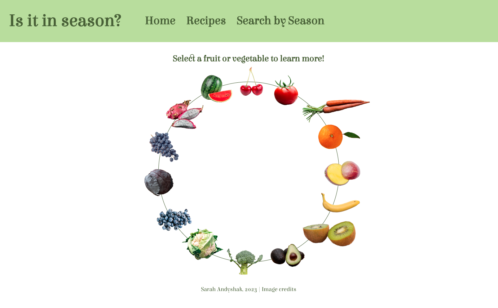
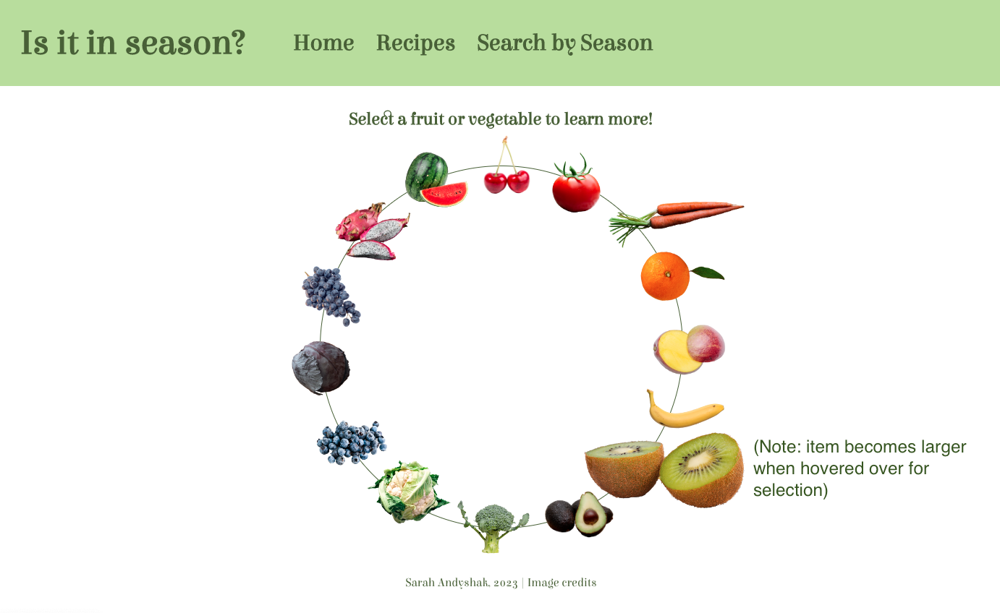
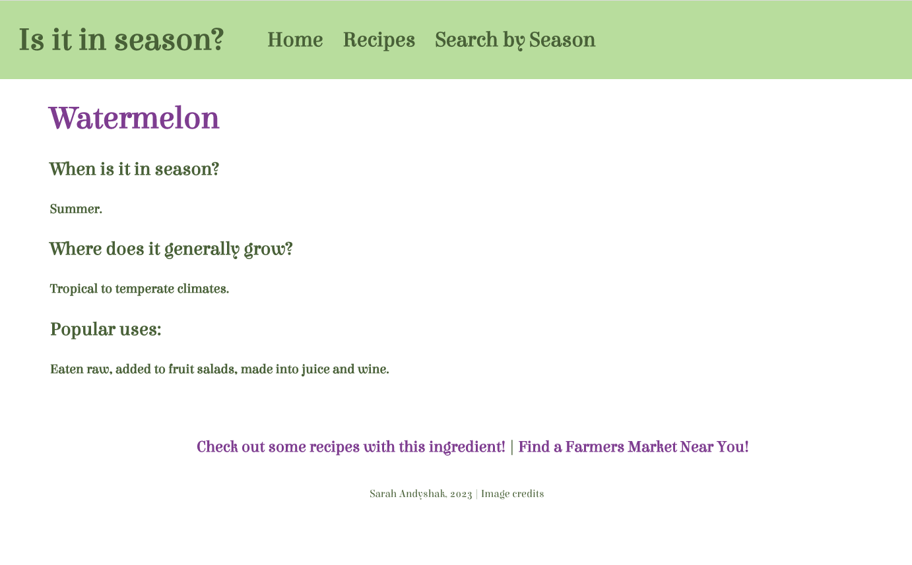
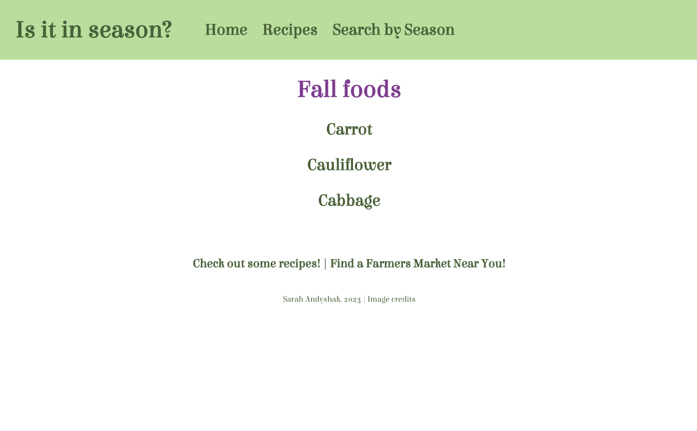

# 🍒 Is it in Season?

### By: Sarah Andyshak

A React application that helps users find out when fruits and vegetables are in season, where to find them, and where to find recipes using these ingredients. This application consumes the [SeasonalFood API](https://github.com/SarahAndyshak/SeasonalFood.Solution). Part of my capstone project.

#### 🍊 [Technologies Used](#technologies-used)
#### 🥦 [How to use this App](#how-to-use-this-app)
#### 🍇 [App plan](#app-plan)
#### 🍎 [Screenshots](#screenshots)
#### 🍌 [Available Scripts](#available-scripts)
#### 🫐 [Known Bugs](#known-bugs)
#### 🥑 [License](#license)
#### 🥕 [Image Credits](#image-credits)

## Technologies Used
* React.js
* JSX
* React Router
* CSS
* VS Code
* The [SeasonalFood API](https://github.com/SarahAndyshak/SeasonalFood.Solution)

## How to use this App

1. Clone this repository to your local machine.
2. Clone the [SeasonalFood API](https://github.com/SarahAndyshak/SeasonalFood.Solution) to your local machine and follow directions for installation in its README.
3. Run `dotnet run` or `dotnet watch run` in your CLI or terminal.
4. If the browser does not automatically open, navigate to _http://localhost:3000_ in your browser.

## App plan

## Screenshots
Splash/home page

Hovering over an item for the link

Details about each item

The recipes page

Selecting a group of items by season

Grouping of items based on their harvest season

## Getting Started with Create React App

This project was bootstrapped with [Create React App](https://github.com/facebook/create-react-app).

## Available Scripts

In the project directory, you can run:

#### `npm start`

Runs the app in the development mode.\
Open [http://localhost:3000](http://localhost:3000) to view it in your browser.

The page will reload when you make changes.\
You may also see any lint errors in the console.

#### `npm run build`

Builds the app for production to the `build` folder.\
It correctly bundles React in production mode and optimizes the build for the best performance.

The build is minified and the filenames include the hashes.\
Your app is ready to be deployed!

See the section about [deployment](https://facebook.github.io/create-react-app/docs/deployment) for more information.

#### `npm run eject`

**Note: this is a one-way operation. Once you `eject`, you can't go back!**

If you aren't satisfied with the build tool and configuration choices, you can `eject` at any time. This command will remove the single build dependency from your project.

Instead, it will copy all the configuration files and the transitive dependencies (webpack, Babel, ESLint, etc) right into your project so you have full control over them. All of the commands except `eject` will still work, but they will point to the copied scripts so you can tweak them. At this point you're on your own.

You don't have to ever use `eject`. The curated feature set is suitable for small and middle deployments, and you shouldn't feel obligated to use this feature. However we understand that this tool wouldn't be useful if you couldn't customize it when you are ready for it.

## Known Bugs
As of 15 May 2023, none.

## License
[MIT](https://opensource.org/license/mit/)

Copyright (c) 2023

## Image Credits
All images were modified from photos posted to unsplash.com. You can find them here:
* [Cherry, Quaritsch Photography](https://unsplash.com/photos/INprSEBbfG4)
* [Tomato, Avin CP](https://unsplash.com/photos/OlXUUQedQyM)
* [Carrots, Armando Arauz](https://unsplash.com/photos/R198mTymEFQ)
* [Orange, Jaehoon Park](https://unsplash.com/photos/la3oGCK0YtI)
* [Mango, Mockup Graphics](https://unsplash.com/photos/2BeAHd_Kmf8)
* [Banana, Mockup Graphics](https://unsplash.com/photos/Kl3467edwsE)
* [Kiwi, engin akyurt](https://unsplash.com/photos/jPVcZsxRGJo)
* [Avocado, Gil Ndjouwou](https://unsplash.com/photos/cueV_oTVsic)
* [Broccoli, Mockup Graphics](https://unsplash.com/photos/l55IGtwI8mI)
* [Cauliflower, Jennifer Schmidt | jsfoodphotography](https://unsplash.com/photos/0XVrBLy73rw)
* [Blueberries, Eiliv Aceron](https://unsplash.com/photos/-D6xO2LUVdk)
* [Cabbage, Tomas Tuma](https://unsplash.com/photos/FJ_F5ROq8b4)
* [Grapes, Andrey Haimin](https://unsplash.com/photos/qtwlKiu6VHg)
* [Dragon fruit, Helen Thomas](https://unsplash.com/photos/vkVLkKi8H60)
* [Watermelon, Art Rachen](https://unsplash.com/photos/izi5AnlbRIA)